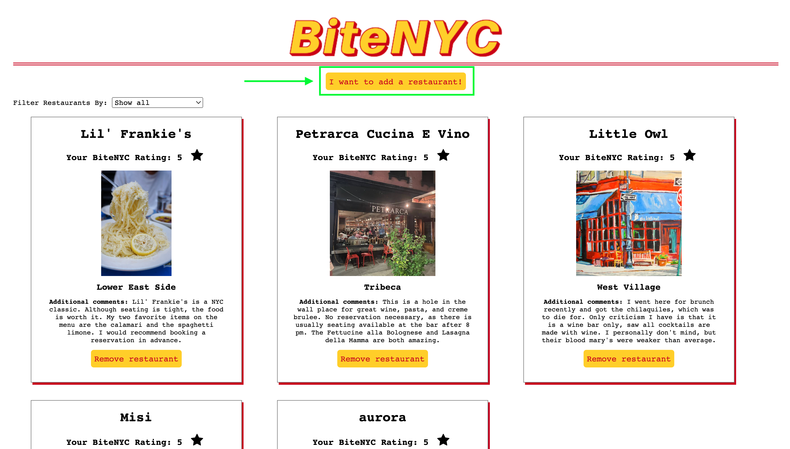

# BiteNYC

## Descripition

BiteNYC is a single-page application that allows users to add restaurants they have visited around NYC. With BiteNYC, users can easily keep track of the restaurants they have visited and share their experiences with others. The program allows users to add the name of the restaurant, their rating, an image of the restaurant, the neighborhood the restaurant is located, and additional comments.

In addition, BiteNYC has a feature that allows users to favorite their restaurants. This feature allows users to keep track of their favorite restaurants and quickly access them for future visits.

BiteNYC is built with HTML, CSS, and JavaScript and uses the DOM to dynamically update the page, and accesses data from a db.json file using json-server. The program is designed to be simple and intuitive, making it easy for users to add and manage their restaurant list.

## Installation and Usage

1. To run the program, make sure you have json-server installed globally. If you don't, you can install it by running:

`$ npm install -g json-server`

2. To start the server, navigate to the project directory in your terminal and run:

`$ json-server --watch db.json`

3. Once the server is running, open the index.html file in your web browser.

4. Upon loading the application, you will see all of the restaurants from the db.json file loaded into cards on the page.

5. To add a new restaurant, click on the "I want to add a restaurant!" button. The input form will appear.

6. If you've changed your mind and do not wish to add a restaurant anymore, click the "Nevermind!" button to hide the form.

7. Fill out all of the necessary input fields on the form and hit "Add Restaurant" when you are ready. This will add the new restaurant card to the list of others, and also add it to the db.json file.

8. You can add restaurants to your favorites list by clicking on the star icon.

9. You can use the filters to sort the restaurants alphabetically, reverse alphabetically, by rating (high to low or low to high), and by whether they are on your favorites list. The "show all" filter will return the restaurants to their original order as they appear in the db.json file.

10. To delete a restaurant, click on the "Remove restaurant" button. This will delete the restaurant from both the DOM and db.json. Note that you should not delete the first five restaurants listed in db.json.

11. Enjoy exploring and adding to your restaurant collection!

ADDITIONAL NOTE: If you accidentally delete one of the first five restaurants from the, please revert the code to the most recent commit. Thank you!

## Features

## Contributing

- As a user, you will be able to input all restaurant information into the form at the top of the page
- As a user, you will be able to favorite and unfavoriite restuarants on your list
- As a user, you will be
